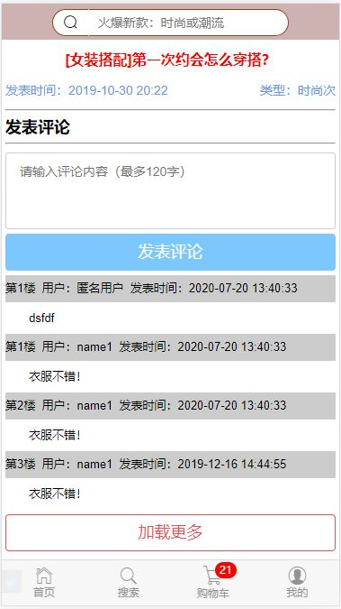

# my-vue-project

> Vue.js 服装商城App

## 效果





### Build Setup
``` bash
# install dependencies
安装依赖
npm install

# serve with hot reload at localhost:8080
启动项目
npm run dev

# build for production with minification
对项目进行打包
npm run build

# build for production and view the bundle analyzer report
npm run build --report
```
### 移动端自适应
* 第一种方法使用px转换rem插件
``` bash
1.首先引入 postcss-pxtorem
npm install postcss-pxtorem --save

2.在js里新建一个rem.js文件
代码如下：
    const baseSize = 32
    // 设置 rem 函数
    function setRem () {
      // 当前页面宽度相对于 750 宽的缩放比例，可根据自己需要修改。
      const scale = document.documentElement.clientWidth / 750
      // 设置页面根节点字体大小
      document.documentElement.style.fontSize = (baseSize * Math.min(scale, 2)) + 'px'
    }
    // 初始化
    setRem()
    // 改变窗口大小时重新设置 rem
    window.onresize = function () {
      setRem()
    }

3.在main.js里引入全局
    rem.js的路径：
    import './lib/mui/js/rem'

4.在修改.postcssrc.js文件
    在.postcssrc.js文件内的 plugins 添加以下配置，配后就可以在开发中直接使用 px 单位开发了
     "postcss-pxtorem": {
          "rootValue": 32,
          "propList": ["*"]
        }
```
* 第二是使用less-loader
```` bash
1.首先在项目里安装less和less-loader
    npm install less less-loader

2.打开webpack.base.conf.js，在 module.exports= 的对象的 module.rules 后面添加一段：
    module.exports = {
        //  此处省略已有的的其他的内容
        module: {
            rules: [
              //  此处省略已有的的其他的规则
              {
                test: /\.less$/,
                loader: "style-loader!css-loader!less-loader"
              }
            ]
        }
    }

3.在代码中的 style 标签中 加上 lang=“less” 属性即可
    <style scoped lang="less">
       .div1 {
            width: 200px;
            height: 200px;
            .div2 {
                width: 100px;
                height: 100px;
            }
        }
    </style>
   
4.配置好less,就可以使用rem
    4.1在js里新建一个loader.js,之后，在写css时，只要将px单位替换成rem，这里设置的比例是100px=1rem,例如，宽度为100px时，可以直接写成1rem。也可以写在index.html的script里。
    fnResize()
    window.onresize = function () {
    fnResize()
    }
    function fnResize() {
    var deviceWidth = document.documentElement.clientWidth || window.innerWidth
    if (deviceWidth >= 750) {
    deviceWidth = 750
    }
    if (deviceWidth <= 320) {
    deviceWidth = 320
    }
    document.documentElement.style.fontSize = (deviceWidth / 7.5) + 'px'
    }
````

## 3.页面切换显示加载loading   (需要引入vux第三方库)
#### 第一步安装vux依赖：
````
npm install vux --save
npm install vux-loader --save-dev   （必须安装，否则后面会报错）
````

#### 第二步修改build/webpack.base.conf.js中的代码（引入vux-loader）
````bash
const vuxLoader = require('vux-loader')
````
#### 第三步继续修改build/webpack.base.conf.js
````
把原有的module.exports = {....}改为 let webpackConfig = {....}
````
##### 并在后面添加：
````
            module.exports = vuxLoader.merge(webpackConfig, {
            　　plugins: [{name: 'vux-ui'}]
            })；
````
##### 案列：
````
let webpackConfig = {....}
module.exports = vuxLoader.merge(webpackConfig, {
            　　plugins: [{name: 'vux-ui'}]
            })；
````
#### 第四步在store.js添加功能代码
```
store.registerModule('vux', { // 名字自己定义
  state: {
    isLoading: false
  },
  mutations: {
    updateLoadingStatus (state, payload) {
      state.isLoading = payload.isLoading
    }
  }
});

router.beforeEach(function (to, from, next) {
  store.commit('updateLoadingStatus', {isLoading: true})
  next()
});

router.afterEach(function (to) {
  setTimeout(() => {
    store.commit('updateLoadingStatus', {isLoading: false})
  }, 300)
});
```
#### 第五步在``.vue``组件中引入
```text
<Loading v-model="isLoadings"></Loading>

import { Loading } from 'vux'
import { mapState } from 'vuex'
    export default {
        name: 'app',
        data(){
          return {
            loadText:"loading"
          }
        },
        components: {
          Loading
        },
        computed:{
          ...mapState({
            isLoading: state => state.myVux.isLoading
          })
        }
      }
```
#### 滚动数据懒加载
##### 要实现滚动加载，需要在列表上添加v-infinite-scroll，并赋值相应的加载方法，滚动到底部时自动执行加载方法。
```text

```
#### 路由懒加载(按需加载)
按需加载,当渲染其他页面时才加载其组件,并缓存,减少首屏加载时间
##### 路由懒加载有三种方式
* 第一种：Vue异步组件技术     
vue-router配置路由，使用vue的异步组件技术，可以实现按需加载（懒加载）。
但是，这种情况下一个组件生成一个js文件。
```text
        {
            path: '/promisedemo',
            name: 'PromiseDemo',
            component: 
              resolve =>  require(['../components/PromiseDemo'], resolve)
        }
```
* 第二种：es提案的import()     
推荐使用这种方式(需要webpack > 2.4)   
webpack官方文档：webpack中使用`import()`    
vue官方文档：路由懒加载使用`import()`
```text
// 下面2行代码，没有指定webpackChunkName，每个组件打包成一个js文件。
const ImportFuncDemo1 = () => import('../components/ImportFuncDemo1')
const ImportFuncDemo2 = () => import('../components/ImportFuncDemo2')
// 下面2行代码，指定了相同的webpackChunkName，会合并打包成一个js文件。
// const ImportFuncDemo = () => import(/* webpackChunkName: 'ImportFuncDemo' */ '../components/ImportFuncDemo')
// const ImportFuncDemo2 = () => import(/* webpackChunkName: 'ImportFuncDemo' */ '../components/ImportFuncDemo2')
export default new Router({
    routes: [
        {
            path: '/importfuncdemo1',
            name: 'ImportFuncDemo1',
            component: ImportFuncDemo1
        },
        {
            path: '/importfuncdemo2',
            name: 'ImportFuncDemo2',
            component: ImportFuncDemo2
        }
    ]
})
```
* 第三种:webpack提供的require.ensure()    
vue-router配置路由，使用webpack的require.ensure技术，也可以实现按需加载。
这种情况下，多个路由指定相同的chunkName，会合并打包成一个js文件。
```text
        {
              path:'/search',
              name:'SearchContainer',
              component: r => require.ensure([],() => r(require('@/components/tabbar/SearchContainer')),'demo'),
            }, {
              path:'/shopcar',
              name:'ShopcarContainer',
              component: r => require.ensure([],() => r(require('@/components/tabbar/ShopcarContainer')),'demo'),
            },
```
For a detailed explanation on how things work, check out the [guide](http://vuejs-templates.github.io/webpack/) and [docs for vue-loader](http://vuejs.github.io/vue-loader).
